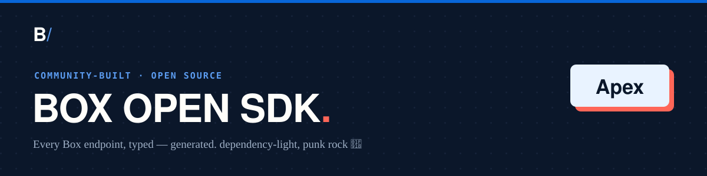

<!-- Generated by box-gantry 0.1.0. DO NOT EDIT. -->


# Box SDK for Salesforce Apex

A **community, unofficial** Box API client for Salesforce Apex, as a
deploy-ready SFDX project. Every class lives in
`force-app/main/default/classes/`; per-endpoint reference docs are in
[`docs/`](docs/README.md). Provenance (engine version + spec
fingerprint) is recorded in `BoxBuildInfo` and below.

> **Not affiliated with, authorized, or endorsed by Box, Inc.** "Box"
> is a trademark of Box, Inc. This is an independent, generated client.

> Generated by box-gantry `0.1.0` from spec fingerprint
> `ee7d55aedefe2fa0`.

## Layout

| Path | What |
|---|---|
| `force-app/main/default/classes/` | model, manager, and client classes (`.cls` + `-meta.xml`) |
| `force-app/main/default/remoteSiteSettings/` | Remote Site Settings for the Box hosts, so callouts are allowed once deployed |
| `docs/` | one Markdown page per endpoint, with runnable snippets |
| `config/project-scratch-def.json` | scratch-org definition |
| `manifest/package.xml` | wildcard deploy manifest |
| `sfdx-project.json` | project + unlocked-package definition (namespace `unbox`) |

## Deploy

```bash
sf org create scratch -f config/project-scratch-def.json -a box-sdk
sf project deploy start -x manifest/package.xml -o box-sdk
```

## Packaging (unlocked 2GP)

The SDK ships as the unlocked package **`Unbox Salesforce SDK`** under the `unbox`
namespace. Unlocked (not managed) so a regenerated version can add, remove,
or rename members freely. One-time, against your Dev Hub (the namespace must
be linked to it):

```bash
sf package create --name "Unbox Salesforce SDK" --package-type Unlocked \
    --path force-app --target-dev-hub myHub
```

This prints the package id (`0Ho…`). **Save it** — this SFDX project is
regenerated on every build, which rewrites `sfdx-project.json` and clears
`packageAliases`, so the `0Ho…` id (not the by-name alias) is the durable
handle. Then build a version by id — this compiles + runs every test in the
namespace and yields the installable ship artifact (a `04t` version id):

```bash
sf package version create --package 0Ho... --installation-key-bypass \
    --code-coverage --wait 60 --target-dev-hub myHub
```

`versionNumber` in `sfdx-project.json` auto-increments its `.NEXT` build
segment; set the major.minor from the engine's spec-diff (a breaking change
is a major bump). Install with
`sf package install --package 04t... --target-org yourOrg`.

## Use

The `Box` class is the single entry point — one field per resource
manager. Construct it with a `BoxClient` (the hand-written runtime
that performs auth + HTTP callouts):

```apex
Box client = new Box(myBoxClient);
FileFull f = client.files.getById(fileId, null, null, null, null);
```

Apex needs no import statements — every generated class is visible in
the namespace. See [`docs/`](docs/README.md) for each endpoint.
